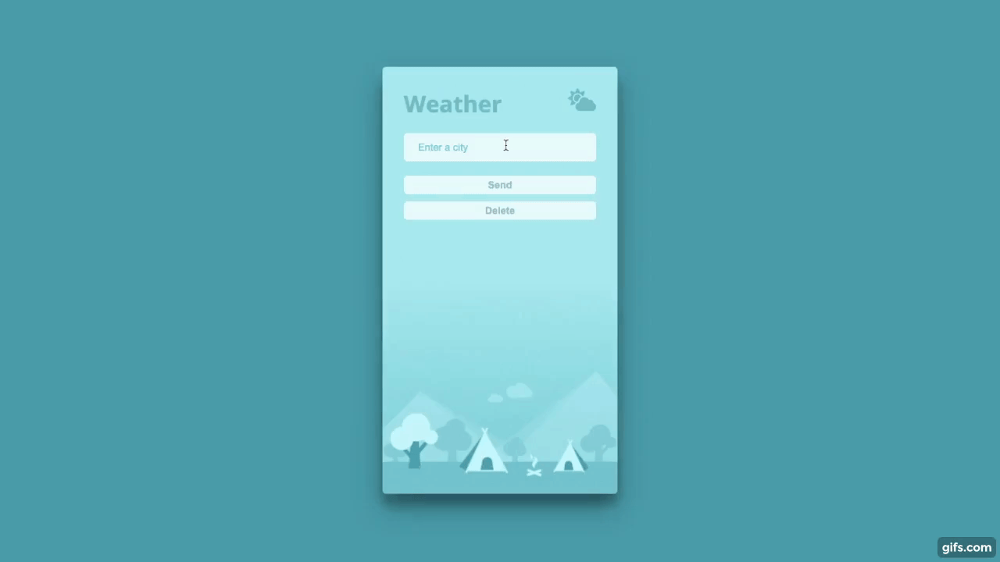

# App Weather

Weather app using [OpenWeather Api](https://openweathermap.org/api). Also Jquery, Ajax and Json.

Enter a city or town to consult. Climate data such as temperature in degrees Celsius, weather description and the coordinates of the city will be displayed

# Weather Api

View:

[https://victoriasimao.github.io/AppWeather/](https://victoriasimao.github.io/AppWeather/)

> Victoria Simao

